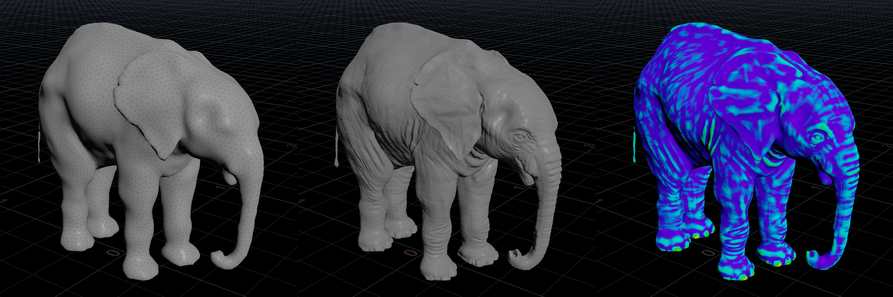

#  Easy Displacement Bake HDA for Houdini 19.5

The Easy Displacement Bake HDA for Houdini is a fast, user-friendly tool designed to streamline and automate the process of baking displacement maps from geometry. The idea is to never need to tweak your displacement bake settings ever again!

This HDA is implemented in pure VEX, and should also see major speed-up times vs baking in renderers, and the normal conventional baking tools.

## Key Features
- **One-Click Solution**: Just plug in your geometry and hit bake. No need to adjust any settings unless you want to.
- **Automatic Scaling**: The HDA automatically scales based on a custom distance algorithm, saving you from having to manually adjust parameters.
- **Mesh Analysis**: Advanced users can enable and adjust various masks that give precise, localised smoothing in areas that you may not want displacement to occur.
- **Visualization Options**: Extensive real-time visualization options in the viewport.

## Installation
Download the HDA file and install in your `houdini19.5/otls/` folder. For detailed instructions, please refer to the [Houdini documentation](https://www.sidefx.com/docs/houdini/assets/install.html).

## Quick Start
After installing Easy Displacement Bake, all it takes to get baking is to first plug in your Low Resolution Geometry into the first input, and then your High Resolution Geometry to the second input. When both inputs are connected (or an input is changed), the `Auto Scale` toggle allows EasyBake to perform its own analysis of your inputs, and decide what the optimal settings should be.

Once the calculation has taken place, you will see a visualization of your bake on the mesh already. This means the bake has already taken place - and saving out your maps should be practically instant!

By default, the filename includes the `<UDIM>` tag. By including this tag in your filename, each UV tile is baked to its respective UDIM position and file. If you have multiple UV tiles on your low resolution geometry, and no UDIM tag specified, then the last iterable tile will be baked. You may also use the `<UVTILE>` tag, and both UDIM and UVTILE lower-case equivalents.

You can also take a look at the [Example .hip File](examples/hip/easy_bake_examples.hip) to see how each feature is used on 6 different use cases.

For advanced users who want to understand the tool further, Easy Displacement Bake includes wiki markup documentation in Houdini that explains each parameter in depth.

## Feedback
If you have any feedback or run into issues, please feel free to open an issue on this GitHub project. I really appreciate your support!

This tool is perfect for artists who need a quick and efficient way to generate displacement maps in Houdini. Enjoy baking!